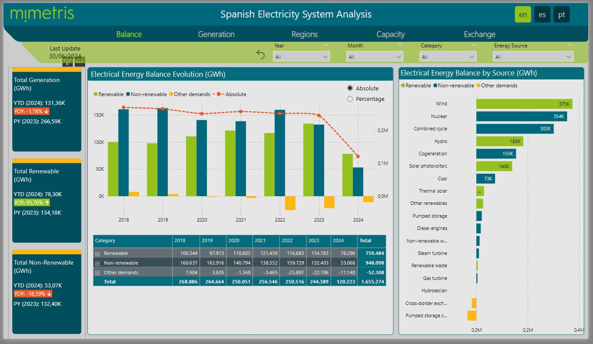
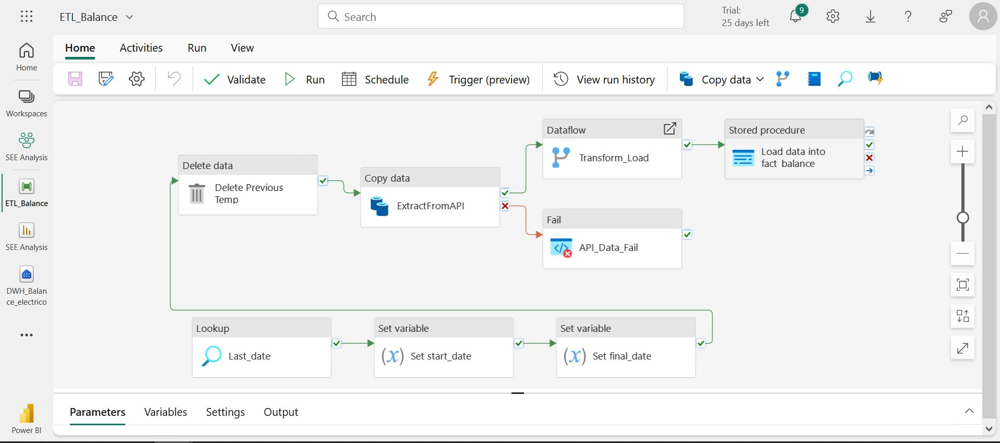
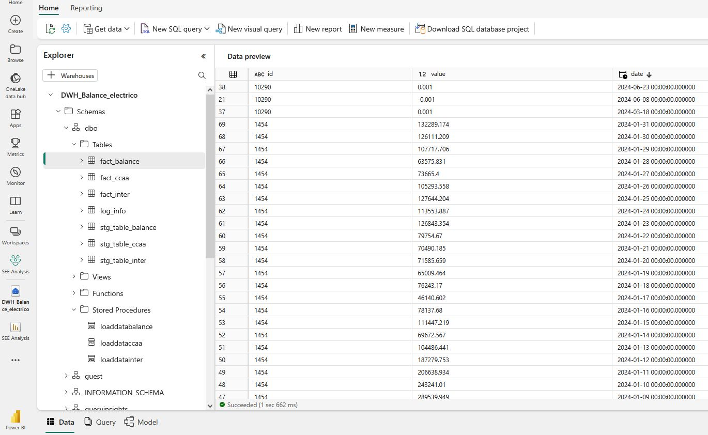
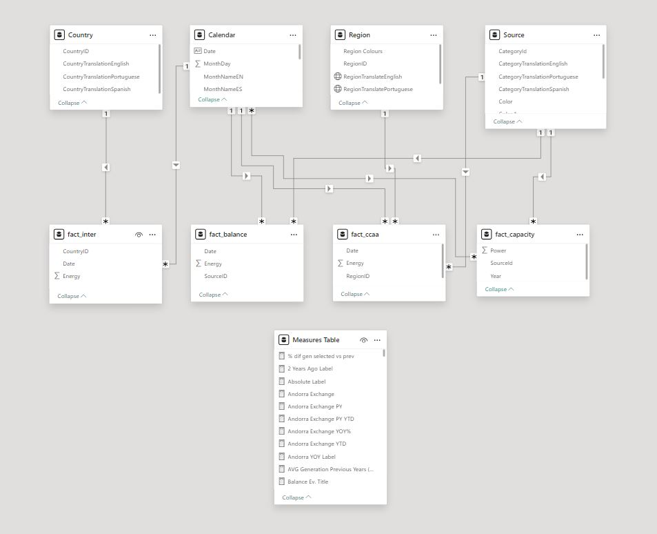
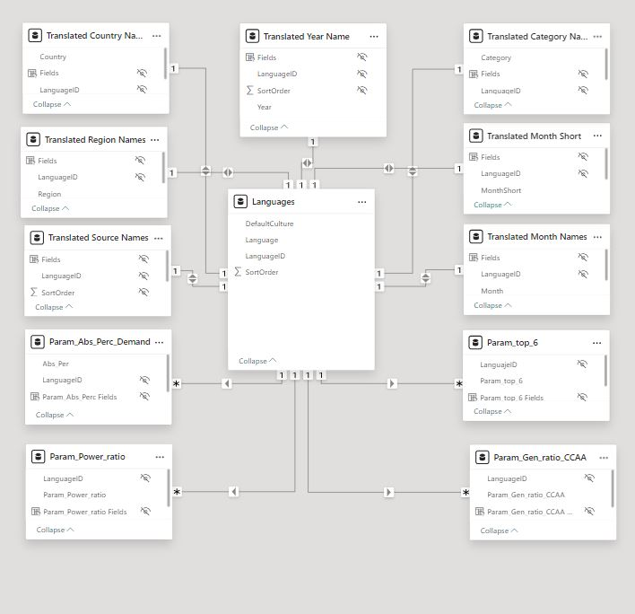

# ⚡ Spanish Electricity System Analysis

> End-to-end data analytics platform for the Spanish National Electricity Grid —
> from API ingestion to Data Warehouse to interactive multilingual Power BI report.

[](https://app.powerbi.com/view?r=eyJrIjoiMWYwOWRiMmItZTNhOS00ZTViLTkzYzEtYWExYTVjYmE0MWM2IiwidCI6Ijk5YTVhNjM1LTY1OGEtNGFhMS04MGIxLTdiM2IwNzcxZTkxYiIsImMiOjl9)



---

## 🎯 Project Goals

Build a fully automated analytics platform covering the complete data lifecycle:

- **Extract** real-time and historical data from the REE public API
- **Store** it in a structured Data Warehouse on Microsoft Fabric
- **Analyze** it through an interactive, multilingual Power BI report

---

## 🏗️ Architecture Overview
```
REE API (JSON)
    │
    ▼
Data Lake (raw storage)
    │
    ▼
Dataflow / Staging Area (transformation)
    │
    ▼
Data Warehouse — Microsoft Fabric (incremental SQL load)
    │
    ▼
Power BI Report (ES / EN / PT)
```

---

## 📡 Data Sources

Data is sourced from [REData](https://www.ree.es/es/datos/generacion), the public API
of Red Eléctrica Española (REE), covering data from 2018 onwards.

**Series extracted:**

| Series | Description |
|--------|-------------|
| Balance | Daily energy generation & consumption by source |
| CCAA | Generation & consumption by autonomous region |
| Inter | Daily international electricity exchange (import/export) |
| Power | Annual installed capacity by energy source |

**API schema:**
```
GET /{lang}/datos/{category}/{widget}?[query]
```

**Example request:**
```
https://apidatos.ree.es/es/datos/balance/balance-electrico?time_trunc=day&start_date=2022-01-01T00:00&end_date=2023-12-31T23:59
```

---

## 🔧 ETL Pipeline — Microsoft Fabric

The ETL process runs on **Microsoft Fabric** using Data Factory, Synapse Data Engineering
and Synapse Data Warehouse.

**Three automated pipelines** (Balance, CCAA, Inter):

1. **Extract** — Pull JSON from REE API → store in Data Lake
2. **Transform** — Dataflow reshapes JSON into tabular format → loads to staging area
3. **Load** — Incremental SQL procedure upserts into final Data Warehouse

Two loading stages: full historical load (2018 → present) + scheduled monthly incremental updates.


*Automated ETL pipeline — Balance series*


*Data Warehouse structure — Balance*

---

## 📊 Power BI Report

Report connects directly to the Fabric Data Warehouse. Key development steps:

- ⭐ **Star schema** data model built from DW tables
- ⚙️ **DAX measures** for generation mix %, YoY trends, import/export balance
- 🌐 **Multilingual model** — Spanish, English and Portuguese
- 🎨 Custom visual template and layout


*Power BI data model*


*Multilingual translations model*

> Multilingual implementation based on [@TedPattison's TranslationsBuilder](https://github.com/PowerBiDevCamp/TranslationsBuilder/blob/main/Docs/Building%20Multi-language%20Reports%20in%20Power%20BI.md)

---

## 🛠️ Tech Stack


---

## 📁 Repository Structure
```
SEE_Analysis/
├── sql/          # T-SQL scripts — incremental load procedures
├── PBI/          # Power BI related files
├── images/       # Screenshots and diagrams
└── README.md
```

---

## 📫 Contact

[](https://www.linkedin.com/in/jose-maria-sancho-navarro/)
[](https://linktr.ee/xemasancho)
[](mailto:xemasancho@gmail.com)
